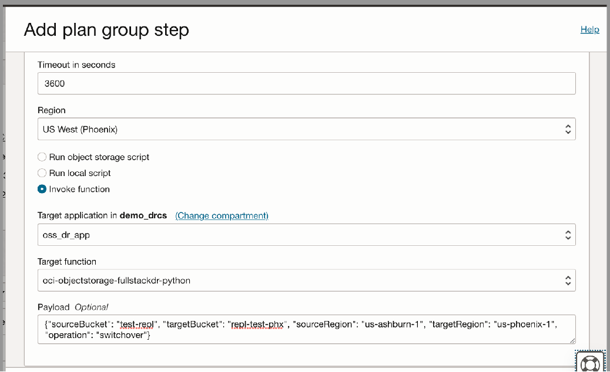

## OCI Function to perform Disaster Recovery for Object Storage

Full Stack Disaster Recovery (FSDR) is an Oracle Cloud Infrastructure (OCI) disaster recovery orchestration and management service that provides comprehensive disaster recovery capabilities for all layers of an application stack, including infrastructure, middleware, database, and application.

Currently, Full Stack DR doesn't directly deal with Object Storage. But, as part of Full Stack DR, customers may want to setup replication for Object Storage Service (OSS) buckets and would like to include recovery of OSS as part of Disaster Recovery operation plan.

This requirement can be addressed using OCI Functions. The OCI Function described in this page can be used to delete the OSS replication policy on primary side or convert the "read only" bucket on standby side to "read write". It can be included as user defined step in the Disaster Recovery Plan.

## Prerequisites

1. Before you deploy this function, make sure you have run steps A, B and C of the [Oracle Functions Quick Start Guide for Cloud Shell](https://www.oracle.com/webfolder/technetwork/tutorials/infographics/oci_functions_cloudshell_quickview/functions_quickview_top/functions_quickview/index.html)
   * A - Set up your tenancy
   * B - Create an application
   * C - Set up your Cloud Shell development environment

2. Have your Oracle Object Storage Namespace available. This can be found by logging into your [cloud account](https://cloud.oracle.com/), under your user profile, click on your Tenancy. Your Object Storage Namespace
   is shown there.

## List Applications

Assuming you have successfully completed the prerequisites, you should see your application in the list of applications.

```
fn ls apps
```

## Create or Update your Dynamic Group

In order to use other OCI Services, your function must be part of a dynamic group. For information on how to create a dynamic group, refer to the
[documentation](https://docs.cloud.oracle.com/iaas/Content/Identity/Tasks/managingdynamicgroups.htm#To).

When specifying the _Matching Rules_, we suggest matching all functions in a compartment with:

```
ALL {resource.type = 'fnfunc', resource.compartment.id = 'ocid1.compartment.oc1..aaaaaxxxxx'}
```

## Create or Update IAM Policies

Create a new policy that allows the dynamic group to `inspect objects` in the functions related compartment.

Your policy should look something like this:

```
Allow dynamic-group <dynamic-group-name> to inspect objects in compartment <compartment-name>
```

e.g.

```
Allow dynamic-group demo-func-dyn-group to inspect objects in compartment demo-func-compartment
```

For more information on how to create policies, go [here](https://docs.cloud.oracle.com/iaas/Content/Identity/Concepts/policysyntax.htm).

## Review and customize the function

Review the following files in the current folder:

- [requirements.txt](./requirements.txt) specifies all the dependencies for your function
- [func.yaml](./func.yaml) that contains metadata about your function and declares properties
- [oss-dr-func.py](./oss-dr-func.py) which is your actual Python function

The name of your function _oci-objectstorage-fullstackdr-python_ is specified in [func.yaml](./func.yaml).

## DR Plan Customization steps

Once the DR plan is created in the standby region (under the standby DR protection group), the user can add custom steps as shown below.  

* Navigate to the Resource page for the DR protection group.  
* Click the Plans link in the Resources panel to list the DR plans for the DR protection group.  
* Click the name of the plan to which you want to add groups and steps.  
* The plan details with a sequential list of plan groups are displayed.  
* Click the Add group button to add a new user-defined group with a step, or click the three-dots Action menu for an existing user-defined group and select Add step to add a step to the user-defined group.  
* Provide a name for the new group (if adding a new group).  
* Provide a name for the new step.  
* Select Enable step to enable the step for execution. If you deselect the box, DR plan execution will skip this step.  
* Select either of the following error modes for the new step:  
	* Stop on error – Indicates that DR plan execution should stop if step execution fails.  
	* Continue on error – Indicates that DR plan execution should continue even if the step execution fails.  

* Provide a timeout value for the step. This is the total duration allowed for step execution before the step is considered timed out.  
* Select a region where the function is deployed
* To execute a function as part of DR plan execution, please select the radio button named "Invoke function".  
* Select the target application from "Target application" dropdown. After that select the target function from the "Target function" dropdown box.  
* This function needs a payload. Please provide the following as payload in the "Payload" box.  

Sample input payload:  

{"sourceBucket": "&lt;source bucket name&gt;", "targetBucket": "&lt;target bucket name&gt;", "sourceRegion": "&lt;source region name&gt;", "targetRegion": "&lt;target region name&gt;", "operation": "&lt;opeation name (either switchover or failover)&gt;"}

Example:  

{"sourceBucket": "test-repl", "targetBucket": "repl-test-phx", "sourceRegion": "us-ashburn-1", "targetRegion": "us-phoenix-1", "operation": "switchover"}

Click the "Add" button to add the plan group to the DR plan.  



When you execute the DR plan, this function will be executed as part of this custom step.  

**Switchover functionality**

The following steps will be be performed to Switchover an OSS bucket  

- Replication policy on the source bucket will be deleted (this will enable the target bucket to become read/write automatically)
- Reverse replication will be setup on the target bucket (i.e., a new replication policy will be created in the target bucket. The replication will be reversed from target to source)

**Failover functionality**  

The following steps will be performed to Failover an OSS bucket. It is assumed that source region is unreachable during failover.  

- Replication will be stopped on the target bucket (this will enable the bucket to become read/write and disables the replication policy on source when it’s reachable. Policy will display an error)

**Cleanup after Failover**

The following steps needs to be manually performed to clean up replication policies after a failover operation.  

- Delete the replication policy in old source bucket (i.e policy which shows error)
- Manually setup replication policy in the new source bucket (i.e., the replication will be reversed)

## Documentation

You can find the online documentation for Oracle Full Stack Disaster Recovery Cloud Service at [docs.oracle.com](https://docs.oracle.com/en-us/iaas/disaster-recovery/doc/overview-disaster-recovery.html).

## Need Help?

Create GitHub [Issue](https://github.com/oracle-samples/full-stack-disaster-recovery/issues)

## Security

Please consult the [security guide](./SECURITY.md) for our responsible security vulnerability disclosure process.

## Contributions

Community contributions are not currently being accepted.

## License

Copyright (c) 2023 Oracle and/or its affiliates.

Released under the Universal Permissive License v1.0 as shown at
<https://oss.oracle.com/licenses/upl/>.
